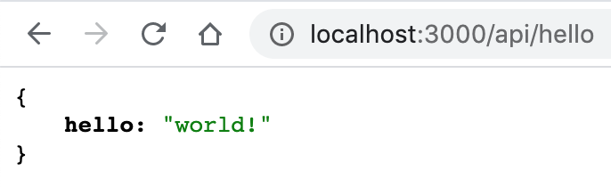
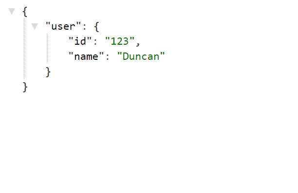

# How To Next.js

_A guide to Vercel's Hybrid Framework for React Applications_

## Table of Contents

- [Introduction](#introduction)
- [Installation and Setup](#installation-and-setup)
- [Navigation Between Pages](#navigation-between-pages)
- [Styling, Assets and Metadata](#styling-assets-and-metadata)
  - [Assets](#assets)
  - [Image Optimization](#image-optimization)
  - [Metadata](#metadata)
  - [Styling](#styling)
- [Pre-Rendering and Data Fetching](#pre-rendering-and-data-fetching)
  - [Static Generation](#static-generation)
  - [Server-Side Rendering](#server-side-rendering)
  - [Incremental Static Regeneration](#incremental-static-regeneration)
  - [Client-Side Rendering](#client-side-rendering)
- [Dynamic Routes](#dynamic-routes)
- [API Routes](#api-routes)
- [Deployment](#deployment)
- [Conclusion](#conclusion)

## Introduction

If you've been paying attention to the web development world, you've probably heard a lot about Next.js. Today I'm going to tell you all I know about Next.js,probably not all of them but something to base your journey into Next.js on.

Next.js is an opinionated open-source web development framework built on top of Node.js that enables server-side rendering and the generation of static websites in React-based web applications. React is a JavaScript library used to create web applications that are rendered in the client's browser using JavaScript.

Next.js was created by Vercel and allows you to create client-side and server-side applications. The framework has a zero-config approach and allows you to write scalable, performant React applications. Next.js provides with a variety of opinionated features out of the box, including:

- Routing using Next's built-in router making use of React Hooks.
- Image Optimization using Next's `Image` component built upon html `img` tags.
- Fast Refresh to update the page without reloading.
- Hosting of Static Files and Assests in a `public` folder.
- Built-in CSS/Sass Support.
- API Routes for easier API management. For any file added to the pages/api directory is treated as an API endpoint with a corresponding API route that can be used for backend functionality and can also be used to run serverless functions.
- Internationalization Routing
- File-System Based Routing. Organizing files and subdirectories within a `pages` directory automatically results in corresponding routes.
- TypeScript Support
- Code Splitting and Bundling to load code on demand.
- Server Side Rendering to render the page on the server.

In this tutorial, we’ll learn the basics of Next.js and at the end of the tutorial, we will create a Simpe Image Gallery. In the process, you’ll see how simple it can be to create a web application powered by Next.js and hosted on Vercel.

Our simple Next.js web app has:

- An input page that allows users to search for a keyword and display images based on the keyword provided.
- A preview page to view a full detailed image of an images clicked by the user.
- A gallery page that displays all of the images fetched from an external API.
- An API Route to fetch data from an external API and send it to the Next.js app.

For this tutorial, you should already be familiar with JavaScript. It’s okay if you’re not familiar with Next.js as the tutorial begins with an introduction to the framework.

## Installation and Setup

The `create-next-app` CLI tool is the simplest way to create a new Next.js application. It can be installed using npm. You can create a new Next.js application using the following command:

```sh
npx create-next-app my-next-app
```

Once the installation is finished, you can navigate to the directory where the application was created and open it in your prefered code editor. The default project structure is as follows:

    my-next-app
    ├── pages
    ├── public
    ├── pages
    │   ├── api
    │   │   └── hello.js
    │   ├── _app.js
    │   └── index.js
    ├── styles
    │   ├── global.css
    │   └── Home.module.css
    ├── .env.local
    ├── .eslintrc.json
    ├── .gitignore
    ├── README.md
    ├── next.config.js
    ├── package.json
    └── yarn.lock

Once everything is in place, you can start the application by opening the terminal and navigating to the directory where the application was created in the terminal. You can then run the following command to start your application.

```sh
yarn dev

# or

npm run dev
```

We are running our application in the development server. This means that the application will be served from the localhost:3000 port locally on our machine. To preview the application running, you can open a browser and navigate to http://localhost:3000.

We should get a preview of the application like this:


If everything is setup correctly, you should see the page on the browser without any issues. Next, we locate the `index.js` file in the `pages` directory. This file is the entry point for the application. We are going to replace all the context of the `index.js` with a simple react component.

```jsx
export default function HomePage() {
  return <div>Thank u, next</div>;
}
```

This is how simple Next.js works. Whenever you put a JavaScript file in the `pages` directory, it is automatically a route, no configuration needed (so a `about.js` will become `localhost:3000/about`). Along with this, you can include dynamic routes (as in, ones with variable names, and do shallow routing (meaning you can change the URL without calling data fetching methods again).


Your new change once saved should reflect in the browser automatically using React Fast Refresh. No need to refresh the page and no configuration is needed. It all works out of the box!

## Navigation Between Pages

In Next.js, a page is a React Component exported from a file in the pages directory. The Next.js app we built so far only has one page. Many different pages can be found on most websites and web apps. Let's look at how we can expand our app with more pages. It's simple to create a new page. Just create a file in the `pages` directory to get a route based on the file name.

Lets begin by replacing our `pages/index.js` file with the following:

```jsx
export default function HomePage() {
  return <h1>Home Page</h1>;
}
```

In the `pages` directory, create two new files called `about.js` and `contact.js`. Add the following to the files respectively:

```jsx
// about.js
export default function AboutPage() {
  return <h1>About Page</h1>;
}
```

```jsx
// contact.js
export default function ContactPage() {
  return <h1>Contact Page</h1>;
}
```

In the browser, go to either the `/about` or `/contact` route. The pages should display without issue. The next thing is to navigate between the pages on the browser.
The `<a>` HTML element is used to link between pages on a website. In Next.js, you use the Link Component from `next/link` to wrap the `<a>` tag. `Link` enables client-side navigation to another page inside the application. Unlike the native `<a>` element, the `Link` component does not refresh the page when the page is navigated, allowing client-side navigation between two pages in the same Next.js project.

To start navigation, let's first import the `Link` component. At the top of your `pages/index.js` route, import the `Link` with the following:

```js
import Link from "next/link";
```

Then replace the content of the `HomePage` component with the following:

```jsx
export default function HomePage() {
  return (
    <div>
      <h1>Home Page</h1>
      <div>
        <Link href="/about">
          <a>About</a>
        </Link>
      </div>
      <div>
        <Link href="/contact">
          <a>Contact</a>
        </Link>
      </div>
    </div>
  );
}
```

Now let's add a `Link` component on the `about.js` and `contact.js` pages to link back to the home component. Import it first then replace the `<h1>` in both pages with the following respectively:

```jsx
// about.js
export default function AboutPage() {
  return (
    <div>
      <h1>About Page</h1>
      <Link href="/">
        <a>Home</a>
      </Link>
    </div>
  );
}
```

```jsx
// contact.js
export default function ContactPage() {
  return (
    <div>
      <h1>Contact Page</h1>
      <Link href="/">
        <a>Home</a>
      </Link>
    </div>
  );
}
```

How the `Link` component works is that it wraps around the `<a>` tag and adds a `href` attribute to it. The `href` attribute is the URL or the page route that the link will navigate to. In the `/about` and `/contact` pages, the `href` attribute on the `Link` component is set to `/`. The router will automatically route files named `index` to the root of the directory. `pages/index.js` will be associated with the `/` route.

We can now preview the `index.js` page in the browser and see the `Link` component working in action.


## Styling, Assets and Metadata

### Assets

Next.js has support for static public folders and serves all static site images, CSS, Google Site Verification,robots.txt, and favicon.ico. In the root directory with the public folder, you access everything in production or built time.

Let's test it out by rendering a static image on a page. In the `pages` directory, create a new `pages/image.js` page. We are simply going to render a static image stored in the public folder on the page.

In the public folder, add a new image file and mind the name of the image and file extension. In the `image.js` file, let's add the following:

```js
export default function ImagePage() {
  return (
    <div>
      <h1>Next.js Logo</h1>
      ;
    </div>
  );
}
```


The page should render as above.

If everything is set up correctly, the image should display correctly in the browser. You notice that the image's `src` is not a relative path, but rather a route. This is a unique Next.js feature. The static images route-path allows the same image to be referenced in the ` `tag code on several pages utilizing the root URL. For example, `src=/logo.png`.

### Image Optimization

Next.js 10 welcomed a built-in image optimization API, `next/image`, as a canonical form for native automatic image optimization. Since we are using an `` tag here and we are going all in Next.js, let's replace the `` tag with the `Image` component from `next/image`.

At the top of the `image.js` file, import the `Image` component:

```jsx
import Image from "next/image";
```

Replace the `` tag with the following:

```jsx
<Image src="/logo.png" alt="Logo" width={128} height={128} />
```

That's it. Next.js takes it from here. Our images will be optimized and will be loaded lazily by default.

### Metadata

There is a `Head` component with Next.js that can be imported from `next/head`. This `Head` component is basically a built-in component that Next.js provides to append elements, such as title and meta tags, to the `<head>` element to improve SEO. The advantage of this component is that, it is on a per page basis, and not a global level meaning each page can have specific SEO information related to that page!

Let's improve the `pages/index.js` file with the `Head` component. Import the `Head` component first:

```js
import Head from "next/head";
```

Let's improve the HomePage component:

```js
export default function HomePage() {
  return (
    <div>
      <Head>
        <title>Home</title>
        <meta name="description" content="Next.js is a React Framework" />
      </Head>
      ...
    </div>
  );
}
```

Try accessing http://localhost:3000/. The browser tab should now say “Home”. By using your browser’s developer tools, you should see that the title and meta tags were added to <head>. You can go ahead and add the `Head` component to the `about.js` and `contact.js` pages as well.

### Styling

Next.js offers many ways to support CSS in your application. Whether you prefer utility CSS with its classes or prefer CSS-in-JS, Next.js has you covered. We are going to implement two styling options. Global CSS for the whole application and component-specific styling.

We want to style the `<h1>` tags in the pages but first let's make into a resuable React component and use it across different pages. In the root directory, create a `components` directory. Create a new `components/Header.js` file and add the following:

```jsx
export default function Header({ title }) {
  return <h1>{title}</h1>;
}
```

We can refactor the `pages/index.js` file to use the `Header` component. Import the `Header` component first:

```jsx
import Header from "../components/Header.js";
```

In the `pages/index.js` file, replace the `<h1>` with the following:

```jsx
<Header title="Home Page" />
```

We can save our file and the component will render correctly. Now that we have abstracted the `<h1>` tag, we can use it in the `about.js` and `contact.js` pages as well. Let's focus on styling the component. Next.js support CSS Modules out of the box.

CSS modules allow you to isolate your CSS by creating files for style-specific components. They are very easy to use, as they are simple CSS but have `.module.css` as the extension.

In the `components` directory, add a new `Header.module.css` file and add the following:

```css
.title {
  font-size: 48px;
  color: red;
}
```

In the Header components file, we can import the style as:

```jsx
import styles from "./Header.module.css";
```

Replace the `<h1>` tag with the following:

```jsx
<h1 className={styles.title}>{title}</h1>
```

We are using the styles from the `Header.module.css` file as a class on the `<h1>` tag. We can see the styling in action on the browser.

Next, we are going to implement global styling for our application. The styles created in `global.css` will then apply to your entire application. To implement global styling, we add the styles to a `global.css` file in the `styles` directory and import it in the `_app.js` file as the App component initializes all the pages in your Next.js pages.

Let's change the background color of the application. In your `styles/global.css`, add the following:

```css
html {
  background-color: #63cad6;
}
```

In the `_app.js` file, import the stylesheets from the `styles` directory as follows:

```js
import "../styles/globals.css";
```

We can also navigate between the pages to see that the style is affecting the whole application snd view the changes from browser. Everything is working 🎉. You can take a break now, you have come a really long way.

## Pre-Rendering and Data Fetching

If you took a break, welcome. If you have stayed this far, keep on, I believe in you. Let's get back to business.

**Rendering in modern web applications is the conversion of the JSX into the HTML representation of our UI.** Where and when rendering happens determines the type of rendering method.

In a simple React application the browser receives an empty html shell along with the javascript instructions to construct the UI, this is called Client-side Rendering.

Next.js pre-renders every page by default. Pre-rendering means that the HTML is created in advance on a server rather than on the user's device using Javascript. This means that while the rendering work is being done on a Client-side Rendered app, the user will see a blank page, whereas in a Pre-rendered app, the user will view the completed UI. Because of the consequences for SEO and social media sharing, it's typically suggested that you utilize pre-rendering unless you have a specific use case for client-side rendering, so let's have a look at the Next.js pre-rendering methods.

1. **Static Generation**: Generates the full HTML for the page content to be rendered in response to every user request.
2. **Server-side Rendering**: For each route that the user can access, a static HTML file is prepared ahead of time. These static HTML files may be stored on a server or a CDN and retrieved by the client as needed.
3. **Incremental Static Regeneration**: Extends the power of static sites by adding some server-side rendering (SSR) goodies on top. It allows the regeneration of static pages during runtime.
4. **Client-side Rendering**: Rendering the HTML of the page on the user's device.

Next.js supports data fetching with both SSR and Static generation. Following functions provided by Next.js make this possible.

1. `getStaticProps`: Used with Static generation to render data
2. `getStaticPaths`: Used with Static generation to render dynamic routes
3. `getServerSideProps`: Applicable to SSR

> Check out this site https://next-usecase.thcl.dev/ to see practical use cases of each of the functions.

### Static Generation

Let's see how we can use the functions provided by Next.js to fetch data. In the `pages` directory, create a new `static.js` file. We are going to implement Static Generation in this file. Let's add the following:

```jsx
import Header from "../components/Header.js";

export default function StaticPage() {
  return (
    <div>
      <Header title="Static Generation" />
      <p>This is a static page</p>
    </div>
  );
}
```

The `getStaticProps` method can be used inside a page to fetch data at build time, e.g. when you run next build. Once the app is built, it won't refresh the data until another build has been run. To use the method, we export an async function in the page. The response from the data fetch is passed as a `prop` to our page component. We are going to fetch a simple data from an external AP using `fetch`

```jsx
export async function getStaticProps(context) {
  const res = await fetch(`https://edge-functions-json-response.vercel.app/`);
  const data = await res.json();

  if (!data) {
    return {
      notFound: true,
    };
  }

  return {
    props: { data }, // will be passed to the page component as props
  };
}
```

Once we have fetched the data, we can destructure the props and render the data in the page. Let's update our `StaticPage` component to render the data:

```jsx
import Header from "../components/Header.js";

export default function StaticPage({ data }) {
  return (
    <div>
      <Header title="Static Generation" />
      <p>{data.message}</p>
    </div>
  );
}
```

We can preview from our browser and see the data is being rendered.

> _During development, the data is fetched every time the page is rendered. During production, the data is fetched only once._

### Server-Side Rendering

Once we have implemented Static Generation, let's move on to Server-side Rendering. In the same pages directory, create a new `server.js` file. We are going to implement Server-side Rendering in this file. Let's add the following:

```jsx
import Header from "../components/Header.js";

export default function ServerPage({ data }) {
  return (
    <div>
      <Header title="Server-Side Rendering" />
      <p>{data.message}</p>
    </div>
  );
}

export async function getServerSideProps(context) {
  const res = await fetch(`https://edge-functions-json-response.vercel.app/`);
  const data = await res.json();

  if (!data) {
    return {
      notFound: true,
    };
  }

  return {
    props: { data }, // will be passed to the page component as props
  };
}
```

The code for the `getServerSideProps` method is similar to the code for the `getStaticProps` method. The only difference is the mode of rendering. `getServerSideProps` is used fetch data on runtime. `getStaticProps` is used to fetch data at build time.

### Incremental Static Regeneration

As I said earlier, Incremental Static Regeneration allows the regeneration of static pages during runtime. By adding a `revalidate` option to the `getStaticProps` method, the static data is regenerated once and server requests for new data will occure at certain time intervals.

```jsx
export async function getStaticProps(context) {
  const res = await fetch(`https://edge-functions-json-response.vercel.app/`);
  const data = await res.json();

  if (!data) {
    return {
      notFound: true,
    };
  }

  return {
    props: { data }, // will be passed to the page component as props
    revalidate: 1, // revalidate after 1 second
  };
}
```

### Client-Side Rendering

Next.js supports client-side rendering but it is not recommended. To use client-side rendering in Next.js, you can use the `useEffect` hook to make the request or the `useSwr` custom hook made by Vercel engineers which implements `stale-while-revalidate`.

We are going to use the `useSwr` hook to make the request as it is the recommended by the Next.js team. For more information on using SWR, check out the [SWR docs](https://swr.vercel.app). Install `swr` using your terminal with the following:

```sh
yarn add swr

# or

npm install swr
```

In the `pages` directory, create a new `client.js` file and add the following:

```jsx
import useSWR from "swr";
import Header from "../components/Header.js";

const fetcher = (...args) => fetch(...args).then((res) => res.json());

export default function ClientPage() {
  const { data, error } = useSWR("/api/client", fetcher);

  if (error) return <div>Failed to load</div>;
  if (!data) return <div>Loading...</div>;

  return (
    <div>
      <Header title="Client-Side Rendering" />
      <p>{data.message}</p>
    </div>
  );
}
```

Note that fetching data from an external source with localhost will result in a CORS error. To fix this, you can fetch the data on an API Route and fetch the data from the API route.

## Dynamic Routes

Next.js defines routes based on the concept of pages. Every Next.js project comes with a `pages` folder. The structure of the `pages` folder determines the structure of your routes and every file inside that folder maps to a route in your application. For static routing, you can create a new route by adding new files to the `pages` directory. For dynamic routes, it is a little bit different.

Dynamic routing refers to generating routes (URLs) to serve individual pages based on data which is subject to change. Next.js handles dynamic routes by supporting brackets around parameters (e.g `[id]`) as a filename.

Let's add a new file to our `pages` directory and name it `[id].js`. We will use this file to generate a dynamic route. Now anytime we visit a route which is not already defined, the component on the `[id].js` page will be rendered.

Let's add the following to our `pages` directory:

```jsx
import Header from "../components/Header";

export default function DynamicPage() {
  return (
    <div>
      <Header title="Dynamic Page" />
    </div>
  );
}
```

Now let's visit https://localhost:3000/duncan. Since we haven't already defined a static route as `duncan.js` in the pages directory, Next.js will fall back to `[id].js` page and Next.js will get the route parameters passed in and then use it as a name for the route.

As everything is working, the let's try and access the route parameters on the page itself. Open the `pages/[id].js` file and update it with the following:

```jsx
import Header from "../components/Header";
import { useRouter } from "next/router";

export default function DynamicPage() {
  const router = useRouter();

  return (
    <div>
      <Header title="Dynamic Page" />
      <p>{router.query.id}</p>
    </div>
  );
}
```

Here, we pull out the route parameters from the query object with the `useRouter` hook. Next.js also supports dynamic nested routes. Learn more about the `useRouter` from the [Next.js docs](https://nextjs.org/docs/api-reference/next/router#userouter)

## API Routes

In addition to creating page routes, which means pages are served to the browser as Web pages, Next.js can create API routes. This is an exciting feature since it means that Next.js may be used to develop a frontend for data that is stored and retrieved by Next.js, using fetch requests to transmit JSON. API routes are mapped to the `/api` endpoint and are stored in the `/pages/api/` subdirectory. When designing full-stack applications, this capability comes in handy. We write Node.js code in those routes (rather than React code). You move from the frontend to the backend, but it's a seamless transition with Next.js.

Create a `/pages/api` directory if you don't already have it. Create a new `hello.js` file in the directory. Add the following to the file:

```js
const handler = (req, res) => {
  return res.json({ hello: "world!" });
};

export default handler;
```

It's that simple. Now on your browser, access http://localhost:3000/api/hello. It should return a json response with the message `{ hello: "world!" }`. As a test, I want you to create an API route on `/api/client` to provide data for the `/client` page we wrote in the Client-Side Rendering section. The browser should return something like the image below.



On the client-side, we can fetch the data from the API endpoint and use it in our application. Let's create a new static page to use the data from the endpoint.

We send a `GET` request when fetching the data. We can also customize the API endpoint to accept other forms of requests including `PUT`, `POST` and `DELETE`

Create a new `/pages/use-api.js` file and add the following:

```jsx
import Header from "../components/Header.js";

export default function StaticPage({ data }) {
  return (
    <div>
      <Header title="Static Generation To Use API" />
      <p>{data.hello}</p>
    </div>
  );
}

export async function getStaticProps(context) {
  const res = await fetch("http://localhost:3000/api/hello");
  const data = await res.json();

  if (!data) {
    return {
      notFound: true,
    };
  }

  return {
    props: { data }, // will be passed to the page component as props
  };
}
```

Now we are able to access the data from the API endpoint in our application. API routes also allow us to define dynamic path parameters in the same manner as pages. For example, using the structure `pages/api/[id].js,` we may design a route to obtain a user by user ID. The `/api/:id` route will be created, and the `id` can be found in the query parameter.

Let's implement a dynamic API route. Create a new `/pages/api/[id].js` file and add the following:

```js
export default function handler(req, res) {
  const {
    query: { id },
  } = req;

  return res.json({ user: { id, name: "Duncan" } });
}
```

No need for `next/router` this time, the routes can be accessed on the `req` object provided internally by Next.js.

Visit http://localhost:3000/api/123 on the browser to see it in action.



Under the hoods, this is all powered by [Micro](https://github.com/vercel/micro), a library that powers asynchronous HTTP microservices, made by the same team that built Next.js.

## Deployment

Congratulations, you are ready to deploy your Next.js application to production. There are many hosting services online for applications. Seeing that the fantastic creators of Next.js created Vercel, it's the smartest choice to go with Vercel as your Next hosting.

Below are the steps in deploying your Next.js application to Vercel.

1. Sign Up for a [Vercel](https://vercel.com) account.
2. Push your project code to Github.
3. Once you’re signed up, import your repository on Vercel. You can do so from here: https://vercel.com/import/git. You’ll need to Install Vercel for GitHub.
4. Since it's a Next.js project, everything will be setup correctly. We have to choose a team and then deploy.
5. Wait for your project to deploy and hurray!

> _PS: Don't deploy on Fridays. The weekends are supposed to be sacred._

## Conclusion

Thank you for staying with me this far. In this tutorial, we’ve seen how it’s easy to create a web application powered by Next.js and hosted on Vercel. We’ve also shown how quickly we can set up pages in a Next.js app, how to style the application both on the component and global level, how to navigate between pages and also my favorite feature of Next.js, how to create API routes. Thank you one again. Till Next time.
