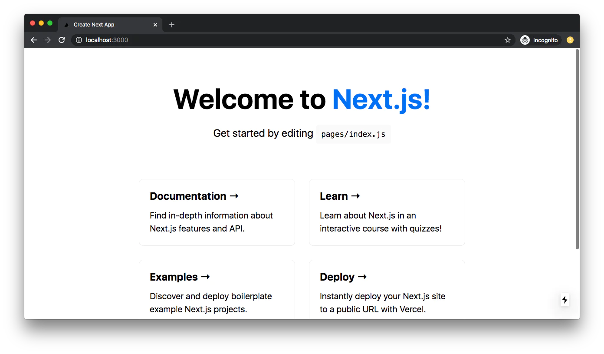
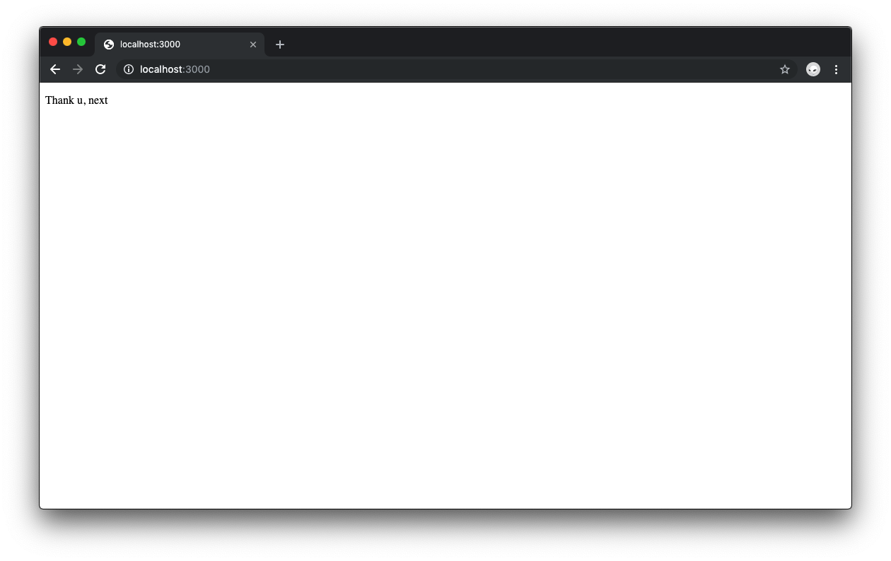

# How To Next.js

_A guide to Vercel's Hybrid Framework for React Applications_

## Introduction

If you've been paying attention to the web development world, you've probably heard a lot about Next.js. Today I'm going to tell you all I know about Next.js,probably not all of them but something to base your journey into Next.js on.

Next.js is an opinionated open-source web development framework built on top of Node.js that enables server-side rendering and the generation of static websites in React-based web applications. React is a JavaScript library used to create web applications that are rendered in the client's browser using JavaScript.

Next.js was created by Vercel and allows you to create client-side and server-side applications. The framework has a zero-config approach and allows you to write scalable, performant React applications. Next.js provides with a variety of opinionated features out of the box, including:

- Routing using Next's built-in router making use of React Hooks.
- Image Optimization using Next's `Image` component built upon html `img` tags.
- Fast Refresh to update the page without reloading.
- Hosting of Static Files and Assests in a `public` folder.
- Built-in CSS/Sass Support.
- API Routes for easier API management. For any file added to the pages/api directory is treated as an API endpoint with a corresponding API route that can be used for backend functionality and can also be used to run serverless functions.
- Internationalization Routing
- File-System Based Routing. Organizing files and subdirectories within a `pages` directory automatically results in corresponding routes.
- TypeScript Support
- Code Splitting and Bundling to load code on demand.
- Server Side Rendering to render the page on the server.

In this tutorial, we’ll learn the basics of Next.js and at the end of the tutorial, we will create a Simpe Image Gallery. In the process, you’ll see how simple it can be to create a web application powered by Next.js and hosted on Vercel.

Our simple Next.js web app has:

- An input page that allows users to search for a keyword and display images based on the keyword provided.
- A preview page to view a full detailed image of an images clicked by the user.
- A gallery page that displays all of the images fetched from an external API.
- An API Route to fetch data from an external API and send it to the Next.js app.

For this tutorial, you should already be familiar with JavaScript. It’s okay if you’re not familiar with Next.js as the tutorial begins with an introduction to the framework.

## Installation and Setup

The `create-next-app` CLI tool is the simplest way to create a new Next.js application. It can be installed using npm. You can create a new Next.js application using the following command:

```sh
npx create-next-app my-next-app
```

Once the installation is finished, you can navigate to the directory where the application was created and open it in your prefered code editor. The default project structure is as follows:

    my-next-app
    ├── pages
    ├── public
    ├── pages
    │   ├── api
    │   │   └── hello.js
    │   ├── _app.js
    │   └── index.js
    ├── styles
    │   ├── global.css
    │   └── Home.module.css
    ├── .env.local
    ├── .eslintrc.json
    ├── .gitignore
    ├── README.md
    ├── next.config.js
    ├── package.json
    └── yarn.lock

Once everything is in place, you can start the application by opening the terminal and navigating to the directory where the application was created in the terminal. You can then run the following command to start your application.

```sh
yarn dev
```

We are running our application in the development server. This means that the application will be served from the localhost:3000 port locally on our machine. To preview the application running, you can open a browser and navigate to http://localhost:3000.

We should get a preview of the application like this:



If everything is setup correctly, you should see the page on the browser without any issues. Next, we locate the `index.js` file in the `pages` directory. This file is the entry point for the application. We are going to replace all the context of the `index.js` with a simple react component.

```js
export default function HomePage() {
  return <div>Thank u, Next</div>;
}
```

This is how simple Next.js works. Whenever you put a JavaScript file in the `pages` directory, it is automatically a route, no configuration needed (so a about.js will become localhost:3000/about). Along with this, you can include dynamic routes (as in, ones with variable names, and do shallow routing (meaning you can change the URL without calling data fetching methods again).



Your new change once saved should reflect in the browser automatically using React Fast Refresh. No need to refresh the page and no configuration is needed. It all works out of the box!
